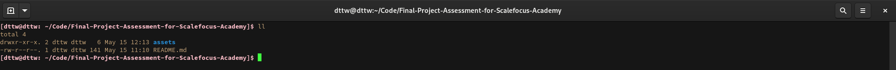
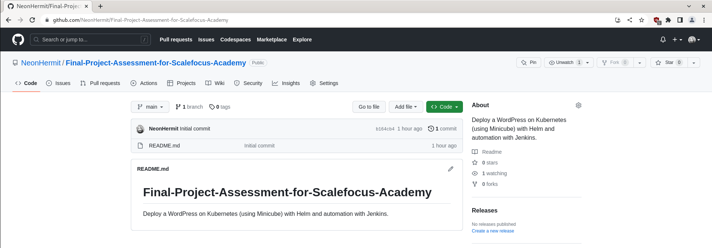
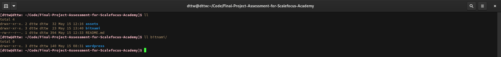
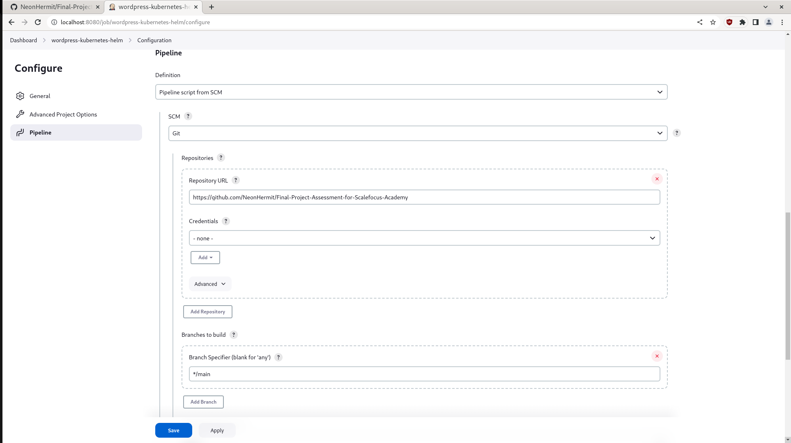

# Final Project Assessment for Scalefocus Academy

*Deploy a WordPress on Kubernetes (using Minicube) with Helm and automation with Jenkins*  

1. Create a repository for the project.  
  
  

2. Download the Helm chart, unzip and put it in the dir.  
   ```bash
    curl -LO https://github.com/bitnami/charts/archive/refs/heads/main.zip
   ```  
     

3. Change the following in *bitnami/wordpress/values.yml*  
   ```yml
   type: LoadBalancer
   
   # into
   
   type: ClusterIP
   ```

4. Create Jenkins Pipeline  
  

5. Create a Jenkinsfile in the repo and push the changes.
   ```Jenkinsfile

   ```

6. Trigger build from Jenkins