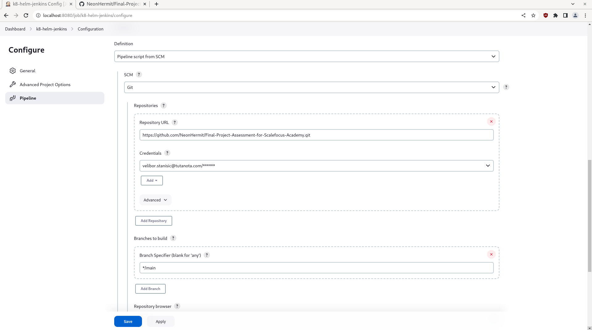
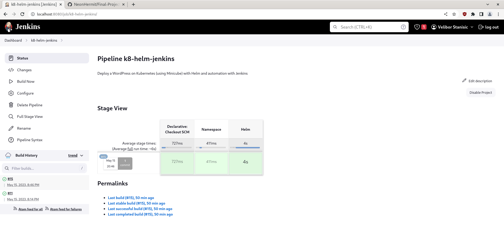
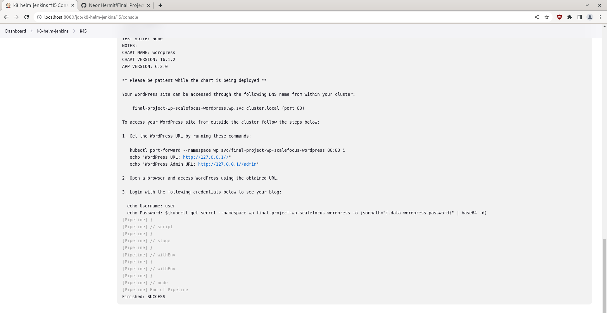
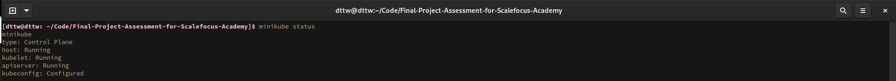
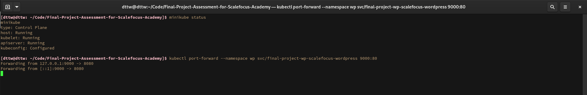
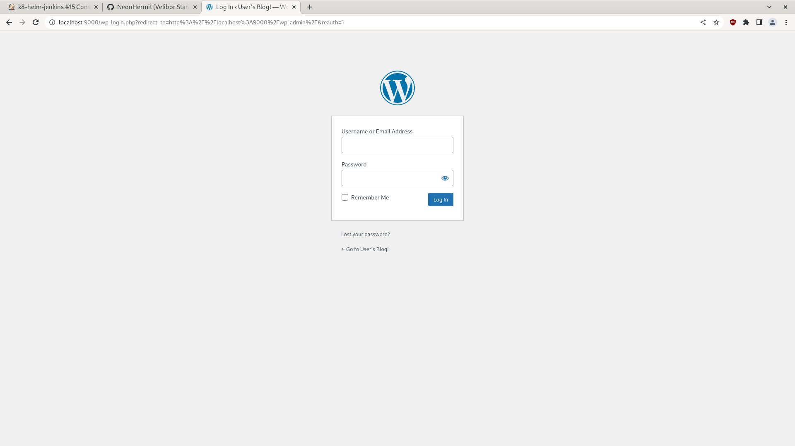
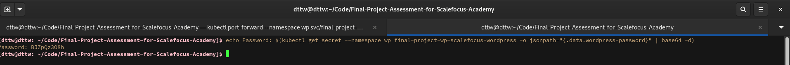
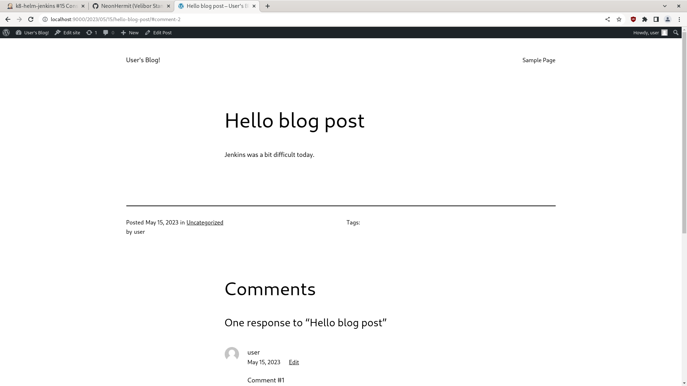

# Final Project Assessment for Scalefocus Academy

*Deploy a WordPress on Kubernetes (using Minicube) with Helm and automation with Jenkins*  

1. Create a repository for the project.  
  
  

2. Download the Helm chart, unzip and put it in the dir.  
   ```bash
    curl -LO https://github.com/bitnami/charts/archive/refs/heads/main.zip
   ```  
     

3. Change the following in *bitnami/wordpress/values.yml*  
   ```yml
   type: LoadBalancer
   
   # into
   
   type: ClusterIP
   ```

4. Install Kubernetes plugins and Create Jenkins Pipeline  
  

5. Create a Jenkinsfile in the repo and push the changes.
   ```Jenkinsfile
   pipeline {
      agent any

      environment {
         KUBECONFIG = '/var/lib/jenkins/.kube/config'
      }

      stages {
         stage('Namespace') {
               steps {
                  script {
                     def namespaceExists = sh(script: 'kubectl get namespace wp', returnStatus: true) == 0
                     if (namespaceExists) {
                           echo 'Namespace wp exists'
                           return
                     } else {
                           echo 'Creating wp namespace'
                           sh 'kubectl create namespace wp'
                     }
                  }
               }
         }

         stage('Helm') {
               steps {
                  script {
                     sh 'helm dependency build ./bitnami/wordpress'
                     sh 'helm upgrade --install final-project-wp-scalefocus ./bitnami/wordpress -n wp'
                  }
               }
         }
      }
   }
   ```

6. Trigger build from Jenkins



7. Minikube status


8. Run 
   ```bash
   kubectl port-forward --namespace wp svc/final-project-wp-scalefocus-wordpress 9000:80
   ```  
     

9. Wordpress
  
  
  
